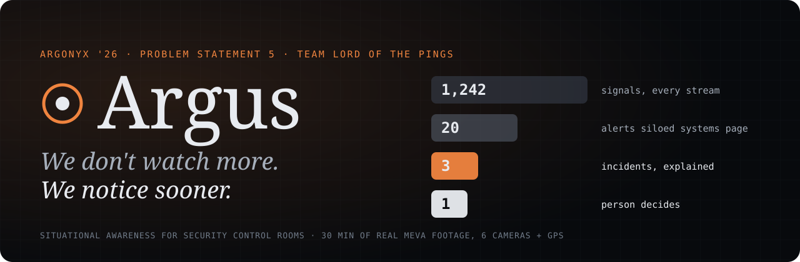
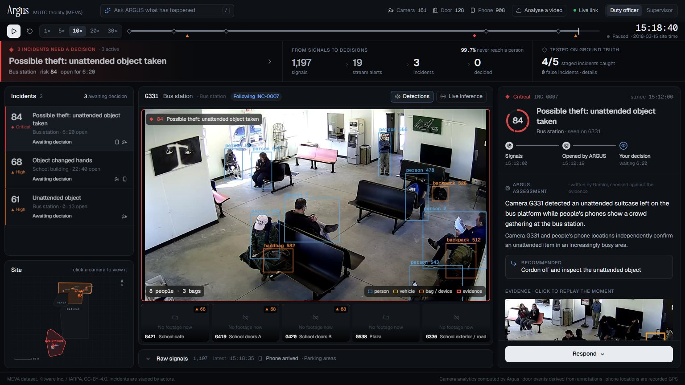
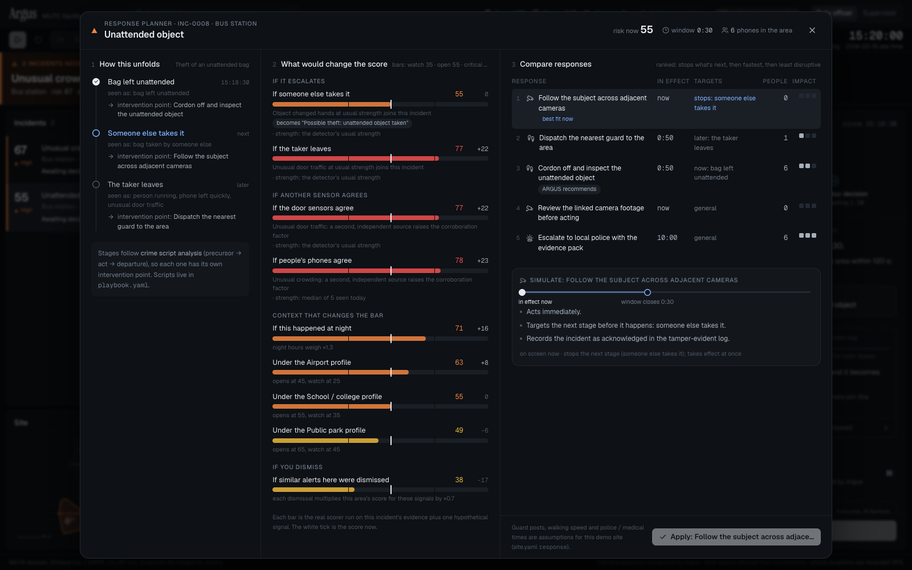
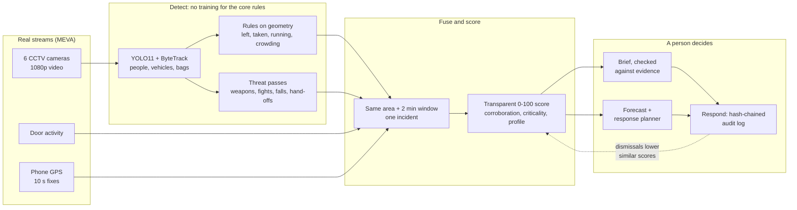

<p align="center">
  
</p>

<p align="center">
  <a href="https://github.com/Argonyx-26/T14_Lordofpings/actions/workflows/ci.yml"></a>
  <a href="https://argus-lordofpings.vercel.app/console/"></a>
  <a href="https://argus-lordofpings.vercel.app/judges.html"></a>
  
  
  
  
</p>

<p align="center">
  <a href="https://argus-lordofpings.vercel.app/console/"><b>Live demo</b></a> ·
  <a href="https://argus-lordofpings.vercel.app/judges.html"><b>For judges</b></a> ·
  <a href="https://argus-lordofpings.vercel.app/">Website</a> ·
  <a href="#-results">Results</a> ·
  <a href="#-how-it-works">How it works</a> ·
  <a href="#-run-it">Run it</a>
</p>

---

In thirty minutes of one ordinary afternoon, a school, its cafe, a plaza and a bus station produced **1,242 signals** from cameras, doors and people's phones. Separate systems watching each stream would have paged a guard **20 times**. Hidden among them: a bag stolen from a cafe table, then another, then a suitcase taken at the bus station and a package left behind on the platform.

**Three things needed a person. ARGUS found them, explained them, and showed where each one was heading.**

ARGUS is a situational-awareness layer for security control rooms. It reads the cameras and sensors a site already owns, fuses weak signals that share a place and a minute into a handful of ranked incidents, projects how each one could unfold, and keeps a human in charge of every decision. Built on site in 24 hours at **ARGONYX '26** (RV University) for **Problem Statement 5: Intelligent Threat Detection and Situational Awareness**.

<p align="center">
  
  <br /><sub>The console at 15:18:40 in the replay. Real footage, real detections, a real incident: nothing on this screen is a mock-up.</sub>
</p>

## Contents

[At a glance](#-at-a-glance) · [What it does](#-what-argus-does) · [90-second tour](#-the-90-second-tour) · [How it works](#-how-it-works) · [Forecasting](#-where-this-is-heading-forecasting-and-response-planning) · [Results](#-results) · [When the AI is wrong](#-when-the-ai-is-wrong) · [Privacy](#-privacy-and-safety) · [Engineering](#-engineering) · [Run it](#-run-it) · [Built in 24 hours](#-built-in-24-hours) · [Team](#-team)

## ◉ At a glance

| | |
|---|---|
| **Staged incidents caught** | **4 of 5**, with **0 false incidents** (MEVA, 30 min, 6 cameras + GPS, scored against the dataset's own ground truth) |
| **Noise removed** | 1,242 signals → 20 per-stream alerts → **3 incidents**: 99.8% never reach a person |
| **Fights** | **76.7%** accuracy, ROC-AUC 0.854 on 300 real CCTV clips, cross-validated by recording (dataset authors: 72%) |
| **Weapons** | handguns AP50 0.51, rifles 0.54 on a camera the model never saw |
| **Live** | 30 fps detection and tracking on one laptop GPU |
| **Forecast** | every incident projected forward with the real scorer: next stage, what would change the risk, and responses compared |
| **Human in charge** | every decision audit-logged in a hash chain; a language model never creates, hides or ranks an incident |

## ✦ What ARGUS does

**1. Fuses the streams a site already has.** Camera analytics, door sensors and phone locations are each noisy on their own. ARGUS joins signals that share an area and a two-minute window into one incident, scored by a formula anyone can read: severity × confidence × area criticality × corroboration × time of day × operator feedback.

**2. Explains every incident in plain words.** A brief (written by Gemini, checked line by line against the evidence) says what happened, where and how sure the sensors are. Every piece of evidence is one click from the moment it happened, on the camera that saw it.

**3. Projects where it is heading.** This is Endsley's level 3 of situation awareness, *projection*, which most dashboards never reach. ARGUS finds the crime script an incident is following (bag left → taken → the taker leaves), re-scores the stages still ahead, shows what would change the risk, and compares every response side by side.

<p align="center">
  
  <br /><sub>The response planner on the offline demo's real snapshot: how this unfolds, what would change the score, and every response compared, then simulated.</sub>
</p>

**4. Keeps a person in charge.** One *Respond* menu: acknowledge, escalate, dispatch a guard, call the police, or dismiss as a false alarm. Each decision is appended to a hash-chained audit log, and a dismissal teaches ARGUS to score similar alerts lower in that area.

**5. Assesses any footage.** Drop in a clip from any camera, even a phone. ARGUS tracks everything in it, flags threats with the same rules, and returns a threat assessment (verdict, risk over time, incidents with forecasts) under the security profile you pick.


**6. Adapts to the site.** One switch: **Airport** (every area critical, any unattended bag or weapon goes straight to a person), **School / college** (the tuned setting) or **Public park** (running and crowds are normal). Measured on the same footage: 4/5, 4/5 and 2/5 caught, with 0 false incidents in all three.

## ▶ The 90-second tour

> [!TIP]
> Open the **[live demo](https://argus-lordofpings.vercel.app/console/)**. It is a real snapshot of the replay at 15:20, bundled with the page, so it works without a backend.

1. **Read the top band**: what needs a decision now, the funnel from every signal to a human decision, and the score against ground truth (click it for each staged incident).
2. **Open the top incident.** The main camera follows it. Click an evidence row to replay that moment on the camera that saw it.
3. **Read "Where this is heading"**: the crime-script stage and what the next stage would do to the risk.
4. **Press "Plan the response"**: what would change the score, and every response compared. Simulate one, then apply it.
5. **Respond**, then open the **Decision log** to see the verified hash chain.
6. **On stage, analyse a video**: hand us a clip and watch the threat assessment appear.

## ⚙ How it works



<details>
<summary><b>The vision pipeline, rule by rule</b></summary>

No training and no labels for the core rules: off-the-shelf COCO weights plus geometry, on one laptop GPU (RTX 5060, 8 GB). Code is in `backend/argus/vision/`.

```
MEVA clip ─► run_tracks.py   YOLO11s + ByteTrack: people, vehicles, bags        ─► data/tracks/<clip>.jsonl
          ─► run_bags.py     YOLO11m @1280, conf 0.1: bags, laptops, phones      ─► <clip>.bags.jsonl
          ─► door_sensor.py  motion of the upper door leaf vs a 10 s median       ─► <clip>.doors.npz
                                   │
                  rules.py + zones.yaml (per-camera polygons drawn with draw_zones.py)
                                   ▼
          data/events/cctv.jsonl  (shared Event schema)  ─►  fusion engine
```

| Signal | Rule |
|---|---|
| `custody_change` | A bag's owner is the person nearest it in its first 2 s. Fires when someone else carries it for ≥ 1 s, or when a resting bag vanishes while a non-owner stands at it and doesn't reappear for 15 s. |
| `abandoned_object` | A stationary bag whose owner has been more than 1.5 body-heights away, or out of the scene, for 15 s. |
| `door_activity` | Indoors: a video door-contact sensor (the top of the door panel moves, with a person at the door within ±3 s). Outdoors: feet enter the door zone. |
| `running` | At least 1.8 body-heights per second for 1 s, so it doesn't depend on distance from the camera. |
| `occupancy` | 10 s head counts, flagged at more than 2.5 σ and 3 people from the previous 60 s (causal, no look-ahead). |
| `weapon_visible` | YOLO11s fine-tuned on real CCTV weapons; a weapon on a person on 3 of 6 frames. |
| `violence` | Body-pose features from YOLO11s-pose (random forest) fused with a pretrained surveillance VideoMAE, on 2.5 s windows, 2 in a row ≥ 0.7. |
| `person_down` | A body lying (wider than tall, torso tilted ≥ 60°) for ≥ 3 s. |
| `hand_off` / `dealing_pattern` | Two people's wrists meet for ≥ 0.4 s; ≥ 3 hand-offs with ≥ 2 people in 10 min by someone who stays put. |

Small bags on the floor score 0.1–0.2, below where ByteTrack starts a track, so `rules.py` links those raw detections itself and re-joins bag tracks that fragment when a bag is picked up. Stories combine signals: a bag left then carried off is **"Possible theft"**; weapon + fight is **"Armed assault in progress"**. Theft and abandonment labels are never read by the vision code; `backend/argus/eval/evaluate.py` is the only thing that reads them.

</details>

## ◎ Where this is heading: forecasting and response planning

Competing systems stop at *what is happening*. ARGUS adds *what happens next, and what each response would do*. It does this without inventing a single number:

| Piece | How it's computed | Grounded in |
|---|---|---|
| **Script stage** | The incident's signals are matched to a crime script in `playbook.yaml` (theft, assault, dealing, crowd), each stage with the signals that show it and the action that disrupts it. | Crime script analysis: precursor → act → departure, each with its own intervention point |
| **What would change the score** | The **real scorer** re-run on the incident's real evidence plus one hypothetical signal: the next stage, another sensor agreeing, night time, the other security profiles, a dismissal. Signal strength is the median of what ARGUS has seen today (cited with its n), or the detector's own emitted value. | `fusion/score.py`, unchanged |
| **Compare responses** | A course-of-action matrix: time to effect (walking distance from the nearest guard post, or stated service times), the stage each action stops, people affected (phones in the area right now), disruption, and the decision it records. Ranked by a stated rule: stops what's next, then fastest, then least disruptive. | The military decision-making process's COA comparison |
| **Simulate and apply** | One response played forward against the evidence window, then applied through the same audit-logged action as the Respond menu. | |

Guard posts, walking speed and police or medical times are **assumptions** for the demo site (`site.yaml → response`), and the console labels them as such. Code: `backend/argus/forecast.py`, tested in `backend/tests/test_forecast.py`.

## 📊 Results

Measured on the MEVA recording of 15 March 2018, 14:50–15:20: six cameras, one facility, scored against the dataset's human ground truth with `python -m argus.eval.evaluate`.

| Claim | Result | n and method |
|---|---|---|
| Staged thefts and abandonments | **4 / 5 caught, 0 false incidents** | every staged theft and abandonment MEVA publishes in the window; 2 cafe thefts, 1 bus-station theft and 1 abandonment caught |
| Event funnel | 1,242 → 20 → **3** | raw events → what per-stream thresholds would page → incidents |
| Security profiles | Airport 4/5 (+6 on watch) · Campus 4/5 · Park 2/5 · **0 false in all three** | same 30 minutes, re-scored per profile |
| Fights | accuracy **76.7%**, ROC-AUC **0.854**; at the pipeline threshold 87/150 fights, 12/150 false (precision 0.88) | 300 real CCTV clips (Akti et al. 2019), 5-fold CV grouped by source recording (74 recordings); body pose fused with a pretrained surveillance VideoMAE used as-is. Pose alone: 74.7%, AUC 0.82 |
| Weapons | AP50 handgun **0.51**, rifle **0.54**; 42/84 appearances alerted, 14 false alerts in 29 min | 3,511 frames from a camera never trained on (Univ. of Seville mock armed attack). Knives AP50 0.09: not claimed |
| Door sensor from video | indoor precision **0.54**, recall **0.75** | ±2 s against human door-open labels, 3 indoor cameras; all 6 cameras: 0.21 / 0.52 |
| Held-out day | staged theft missed, **0 false incidents** | 5 March, unseen and untuned; the suitcase sat at the frame edge with only its handle in view |
| Live inference | **30 fps**, 13–23 ms a frame | YOLO11s at 960 px, FP16, one RTX 5060 laptop GPU |

> [!IMPORTANT]
> **We report our misses.** A black purse on a black bench, and a suitcase hidden at the edge of the frame on a different day: both are objects the detector cannot see at rest. A dual-background "object removed" detector does find the purse, but it also added 12 false alarms, so it stays switched off.

## ⚖ When the AI is wrong

- **Incidents come from measured rules and a transparent score, never from a language model.** The model writes briefs and answers questions, and every citation it makes is checked against the log.
- **We tried an AI second opinion on camera alerts.** Gemini, shown frames around each alert, removed the one false alert but also four of six real thefts. It stays out.
- **Every decision is a person's**, logged with role and time in an append-only hash chain that breaks if anyone edits it.
- **Dismissals feed back**: each one multiplies that area's score for those signals by 0.7, so the system gets quieter where operators say it is wrong.

## 🔒 Privacy and safety

| Data | What ARGUS does with it |
|---|---|
| Faces | No face recognition and no biometrics. People are anonymous boxes, tracked within one camera. |
| Phone locations | Used only as counts per area (crowding, people leaving at once), never linked to people on camera or shown by identity. The demo's GPS is MEVA's consented actor data. |
| Decisions | Append-only, hash-chained audit log with role and time. |
| Footage | Stays on the site's own machine: the whole demo runs offline on one laptop. |

## ◉ The design: one eye that watches everything

The console is built around a single living instrument, the **ARGUS eye** (Argus Panoptes was the hundred-eyed watcher of Greek myth). Every part of it is data, nothing is decoration:

| Part | What it shows |
|---|---|
| Outer ticks | the watch, turning while the replay plays |
| Six arc segments | the six cameras: lit when they have footage, coloured when their area has an incident |
| Three rotating rings | camera analytics, door sensors and phone locations, each pulsing with its live signal rate |
| Particles flowing inward | every real signal. Routine events fade halfway (absorbed); only signals reach the pupil: the 1,242 → 3 funnel, live |
| Iris and pupil | the most urgent state on screen: the pupil dilates and the iris changes colour from calm to critical |

It opens full screen while the console links up (the percentage is real readiness), then flies into its place in the top band. Around it, motion only ever says that something changed: new incident titles **decode** out of scrambled glyphs, briefs **come into focus** when they are written, the incident list **re-ranks on springs**, counts **roll**. Glass appears only where UI floats over footage. Everything respects `prefers-reduced-motion`, runs on one animation loop that stops when the tab is hidden, and adds no long tasks at 30× replay.

On the website the same eye becomes the hero: real footage from the bus-station camera seen through its aperture, which opens as you scroll until the frame fills the screen.

<sub>Inspired by the radial instruments of anime.js, Podium's logo-as-mask reveal, Bklit's decoding type, Kokonut's blur reveals, Motion's springs and Lenis's scroll; status colours follow the Astro UXDS status system.</sub>

## 🛠 Engineering

- **50 backend tests and 14 frontend tests** on every push ([CI](https://github.com/Argonyx-26/T14_Lordofpings/actions/workflows/ci.yml)). Tests that need MEVA video skip themselves; the rest run anywhere.
- **Deterministic**: the same events in the same order give the same incidents, scores and forecasts.
- **Offline on stage**: fonts, briefs and Ask ARGUS answers are cached; nothing needs the network.
- **Windows-first demo**: PowerShell setup, run and stop scripts, UTF-8 file I/O everywhere, one process at `http://localhost:8000`.
- **Measured, then shipped**: every threshold lives in `rules.py`, `site.yaml`, `playbook.yaml` or `profiles.yaml`, and every claim above has a command that reproduces it.

<details>
<summary><b>Stack</b></summary>

Python 3.12 · FastAPI · Pydantic · Shapely · Ultralytics YOLO11 · ByteTrack · scikit-learn · OpenCV · React 19 · TypeScript · Vite · Tailwind CSS 4 · lucide · Gemini (briefs, Ask ARGUS) with a deterministic template fallback · GitHub Actions · Vercel (website) · Raah analytics

</details>

## ▶ Run it

**Publish the website** (site + offline console demo, with Raah analytics) from any machine: `scripts/deploy_site.sh` (Vercel; see the script's header).

**The live demo** needs nothing: [argus-lordofpings.vercel.app/console](https://argus-lordofpings.vercel.app/console/).

**The full demo on the Windows laptop**: see [docs/RUN_WINDOWS.md](docs/RUN_WINDOWS.md). Run `scripts\setup_windows.ps1` once, then `scripts\run_demo.ps1 -Prepare`. Everything is one process at http://localhost:8000.

**Development (macOS / Linux / Windows)**:

```bash
python -m venv .venv && .venv/bin/pip install -r backend/requirements.txt   # Windows: .venv\Scripts\pip
scripts/get_meva_meta.sh                      # annotations + GPS (Windows: scripts/get_meva.ps1, includes video)
cd backend
../.venv/bin/python -m pytest -q              # the real-data tests run when data/meva exists
../.venv/bin/python -m argus.eval.evaluate    # metrics vs ground truth -> data/cache/metrics.json
../.venv/bin/uvicorn argus.api.main:app --port 8000
cd ../frontend && npm install && npm run dev  # console on :5173, talking to :8000
```

The vision pipeline writes `data/events/cctv.jsonl` (schema in `backend/argus/schema.py`); the backend picks it up on restart. Briefs use Gemini when `GEMINI_API_KEY` is set in `.env` (or Claude with `ANTHROPIC_API_KEY`) and fall back to a deterministic template (`ARGUS_LLM=off` forces it). Video, annotations and GPS are not stored in git: the `scripts/get_meva*` helpers fetch them.

<details>
<summary><b>Repository layout</b></summary>

```
backend/argus/        schema, ingest, replay clock, fusion + scoring, forecast, LLM brief, Ask ARGUS, API, evaluation
backend/argus/vision/ tracking, bag pass, door sensor, rules, threat detectors, live tile, training and eval scripts
backend/argus/config/ site.yaml, playbook.yaml (actions, stories, scripts), profiles.yaml, areas.geojson
backend/tests/        pytest suite
frontend/             React + Vite + Tailwind console (and the offline demo build)
site/                 project website and the judges' page (served at :8000/site/; published with scripts/deploy_site.sh)
scripts/              data download, Windows setup / run / stop
docs/                 run guide, pitch, demo video script, held-out results
```

</details>

## ⏱ Built in 24 hours

Everything here was made on site at RV University between 11:00 on Friday 25 September and 14:30 on Saturday 26 September 2026. The commit history is the record: the first commit landed at 12:42, and they kept coming through the night.

| Fri | Milestone |
|---|---|
| 12:30 | Decision: no synthetic data. MEVA chosen as the real multi-camera source |
| 12:50 | Backend core: event schema, fusion engine, transparent scoring, replay clock, audit log |
| 12:53 | Vision pipeline: YOLO11 tracking, a low-confidence valuables pass, camera rules |
| 13:23 | Bag false alarms cut from 6 to 2 with recall unchanged at 4 of 5 |
| 13:40 | A door sensor made from video alone, no training |
| 15:47 | Measured: 4 of 5 caught, 0 false incidents, 30 fps live |
| 16:15 | Analyse any footage: upload a clip and the full pipeline runs on it |
| 18:31 | Held-out evaluation on footage from another day |
| 19:11 | Ask ARGUS: questions answered only from the log, with citations |
| 21:14 | Console redesigned around one question: what needs a person right now? |
| 21:54 | Mentor round: security profiles, weapons, fights, falls, hand-offs |
| 22:54 | Forecasting and response planning; threat assessment for uploaded footage |

**AI assistance, disclosed.** We used Claude Code as a coding assistant and Gemini inside the product for briefs. Every change was reviewed, run and tested by us, and every number above comes from our own measurements.

## 👥 Team

**Lord of the Pings**, ARGONYX '26

| | Role |
|---|---|
| **Tanush Deepak** ([@officialtanushdeepak-bit](https://github.com/officialtanushdeepak-bit)) | Team lead: product, backend core (fusion and scoring), console and forecasting, website and pitch |
| **L Mohit Jain** ([@jacklachan](https://github.com/jacklachan)) | Vision pipeline, threat detectors and security profiles, Ask ARGUS, evaluation, and the demo laptop |

## 🙏 Acknowledgements

- **MEVA dataset**: Kitware Inc. / IARPA, [mevadata.org](https://mevadata.org), CC-BY-4.0. Incidents in MEVA are staged by actors among ordinary passers-by.
- **Fight clips**: Akti et al. 2019, *Vision-based Fight Detection from Surveillance Cameras* (MIT licence).
- **Weapon footage**: University of Seville mock armed attack dataset (CC BY-NC 4.0).
- **Ultralytics YOLO11** and **ByteTrack**; status design after the **Astro UXDS** status system; site areas refined from OpenStreetMap footprints and MEVA camera calibrations.

<p align="center"><sub>Built for control rooms that are drowning in alerts. We don't watch more. We notice sooner.</sub></p>
