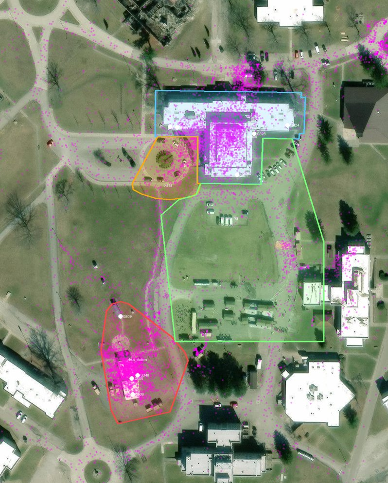

# Fusion areas (backend/argus/config/areas.geojson)

Built from three independent references and cross-checked against the density of the real MEVA GPS fixes:

| Area | How it was placed |
|---|---|
| school | OpenStreetMap footprint of "5101 Trio Academy" (the MEVA school: cafe G421, doors G419/G420) + 6 m |
| plaza | Ground footprints of cameras G336 and G638, projected from MEVA KRTD calibrations; the semicircular drive west of the school |
| bus_station | OSM footprint of "Bus Stop" + 12 m, merged with ground footprints of bus cameras G340/G505/G506/G509 |
| parking | Ground footprints of cameras G328/G339/G424 + the central staging lot (MEVA site-map area 4) |

MEVA camera calibrations are in an east-north-up metre frame with origin 39.04977294, -85.52924953 (see the MEVA
`metadata/camera-models` README). Areas do not overlap. 7,977 of the 13,817 GPS fixes in the demo window fall inside an
area; the rest are elsewhere on the campus (hospital, roads, housing).

Credits: imagery © Esri, Maxar, Earthstar Geographics; building footprints © OpenStreetMap contributors (ODbL);
camera models and GPS © Kitware Inc. / IARPA (MEVA, CC-BY-4.0).
